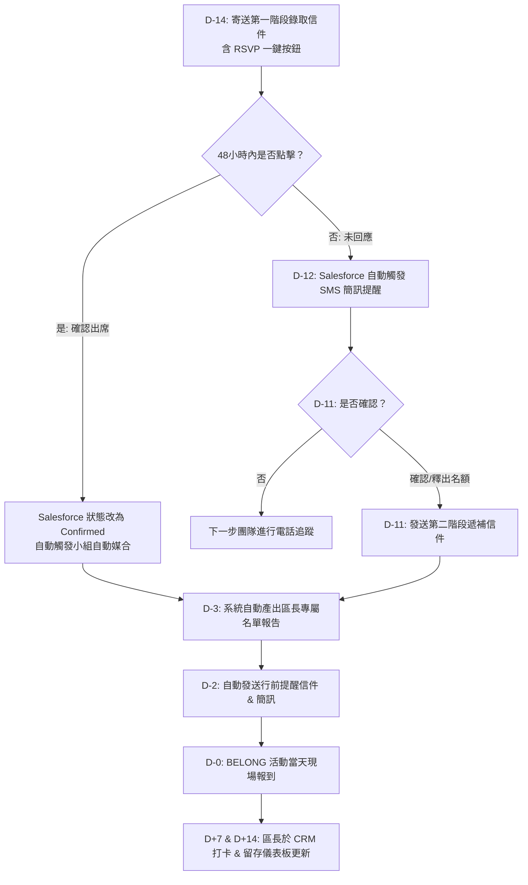

# 📋 Taipei Campus BELONG 活動營運與 Salesforce CRM 自動化 SOP 完整參考手冊

> **活動名稱**：Taipei Campus BELONG 活動  
> **活動上限**：48 人  
> **主辦單位**：The Hope Church Life & Operation 團隊  
> **協助團隊**：Next Steps 團隊 (下一步團隊)、IT 團隊  
> **主要系統**：Salesforce CRM、Email Server (`Belong.tpe@thehope.co`)、SMS 簡訊系統  

---

## 🎯 流程優化核心目標

1. **零人工查信**：改用 Salesforce **一鍵 RSVP 按鈕**，點擊後系統自動更新出席狀態。
2. **自動化備案**：針對未開信者自動觸發 **SMS 簡訊提醒**，將人工電話確認工作量降低 70% 以上。
3. **智慧小組媒合**：Salesforce Flow 依據「可聚會時間」自動比對並指派對應區長與臨時小組。
4. **數據化留存追蹤**：區長直接於 CRM 打卡，系統自動生成第 1 週與第 2 週留存率儀表板。

---

## 📅 活動時程與自動化工作流程 (Automated Timeline)

---

## 📝 詳細階段說明

### 階段一：活動前預備 (活動當天與結束當天)

| 步驟 | 權責單位 | 作業項目 | Salesforce CRM 自動化機制 |
| :--- | :--- | :--- | :--- |
| **1.1** | Church Life | 建立下一次 BELONG 活動 CRM 報名頁面與 QR Code | 自動啟用報名表單，確保溝通語言與欄位正確。 |
| **1.2** | Church Life | LINE@ 近期活動設定 | 更新專屬 QR Code 選單連結。 |
| **1.3** | IT / Church Life | 設置 Salesforce 自動配對規則 | 確認區長小組聚會時間與容納人數資料無誤。 |

---

### 階段二：雙階段通知與出席確認 (D-14 ~ D-5)

#### ✉️ 第一階段通知 (D-14)
* **執行時間**：8/30 09:00 AM
* **發送對象**：第一階段預錄取會眾
* **信件標題**：`【The Hope 09/13 BELONG活動 成功報名與出席確認】`
* **信件內容**：（包含基本活動資訊與報到提醒）
* **RSVP 動態按鈕**：
  * `[ ✅ 我確認會準時出席 ]` $\rightarrow$ 點擊後跳出確認頁，Salesforce 自動更新為 `Confirmed`。
  * `[ ❌ 這次無法出席，預約下次 ]` $\rightarrow$ 點擊後跳出備案頁，Salesforce 自動更新為 `Cancelled` 並寄送下期報名連結。

#### 📲 自動化簡訊備案 (D-12)
* **執行時間**：9/1 10:00 AM
* **自動邏輯**：Salesforce 偵測 `RSVP Status == Pending` 之名單，自動發送簡訊。
* **簡訊內容**：  
  `【The Hope】親愛的家人，已寄送 9/13 BELONG 活動出席確認信至您的信箱，請點擊連結完成確認以保留名額：[RSVP一鍵連結]`

#### 📞 電話追蹤與第二階段遞補 (D-11 ~ D-7)
* **執行時間**：9/2 (D-11) 早上～中午
* **權責單位**：**Next Steps 團隊 (下一步團隊)**
* **作業說明**：
  1. 上午：在 Salesforce 直接開啟「未確認名單清單」，撥打電話（至少 2 次）。電話通話後直接於 CRM 勾選出席狀態。
  2. 下午 2:00 PM：Salesforce 自動對「第二階段錄取會眾」發送通知信（回覆截止日 9/4 11:59 PM）。
  3. 9/6 (D-7)：下一步團隊針對第二階段未回覆者撥打電話確認。

#### ✉️ 釋出名額與預約下次通知 (D-5)
* **執行時間**：9/8 10:30 AM
* **發送對象**：最終未聯繫上或未確認出席之會眾
* **信件標題**：`【The Hope BELONG活動 相關通知與下次預約】`
* **信件內容**：告知本次名額已釋出給候補家人，並附上 10/18 下一次 BELONG 活動的優先報名連結。

---

### 階段三：小組自動媒合與行前通知 (D-3 ~ D-2)

#### 🤖 Salesforce 小組自動配對 (D-3)
* **執行時間**：9/10
* **配對優先順序**：
  1. **第一優先**：`會眾可聚會時間 == 小組聚會時間`
  2. **第二優先**：`年齡層` / `生活狀態 (婚姻狀況)`
* **自動化輸出**：
  1. Salesforce 自動將確認會眾歸類至 `【BELONG活動 區長○○○】` 臨時小組。
  2. 自動發送 `區長專屬新朋友名單報告` 連結給各區長，區長可直接線上檢視會眾資料（姓名、年齡、聚會時間、信仰歷程、禱告事項）並開展禱告預備。

#### 🔔 行前通知 (D-2)
* **發送時間**：9/11 10:30 AM
* **發送管道**：Email + SMS 簡訊
* **信件標題**：`【09/13 BELONG 活動行前通知】`
* **通知重點**：提醒報到時間為 **3:45 PM – 4:00 PM**，地點於 **1F 副堂**。逾時名額將釋出。

---

### 階段四：活動當天與後續留存追蹤 (D-0 ~ D+14)

#### 📍 活動當天 (D-0)
1. **報到區作業**：工作人員以 iPad 登入 Salesforce Attendance 介面進行一秒掃 Code / 姓名快速報到。
2. **引導與配對**：報到處人員依系統產出之區長分組名單，將新朋友引導至對應區長的專屬桌位。

#### 📊 活動後留存率追蹤 (D+7 & D+14)
1. **小組長/區長打卡**：區長或小組長於活動後第一週與第二週小組聚會時，直接於 Salesforce 進行出席打卡。
2. **即時留存率儀表板 (Salesforce Retention Dashboard)**：
   * 儀表板自動顯示：
     * **指標 1**：9/13 BELONG 實際出席率
     * **指標 2**：第 1 週小組成功進入率 (%)
     * **指標 3**：第 2 週小組持續出席率 (%)
   * Church Life Leader 可直接於 CRM 檢視各區成果與未進入小組之原因，無需手動於 LINE 群組進行統計與文字回報。

---

## 🛠️ 給 IT 團隊的 Salesforce 技術需求規格

1. **RSVP Web Hook / Flow Builder**：
   * 建立動態加密 URL 帶入 `Registration_ID`。
   * 建立公用輕量頁面 (Site/Experience Cloud)，點擊按鈕即刻寫入 `Status` 欄位。
2. **SMS 簡訊平台 API 串接**：
   * 整合三竹簡訊 / Every8D / Twilio 等簡訊 API 至 Salesforce Flow。
   * 建立未確認提醒簡訊之 Trigger Rule。
3. **Auto-Matching Flow 邏輯**：
   * 條件：`Registration.Available_Time__c == Group.Meeting_Time__c`
   * 動作：更新 `Contact.Assigned_Leader__c` 欄位並自動加入對應 Campaign/Group。
4. **區長與 Church Life 儀表板權限**：
   * 設定區長僅能檢視其被分配之新朋友名單。
   * 建立 Church Life 專用之 BELONG Retention Dashboard。
